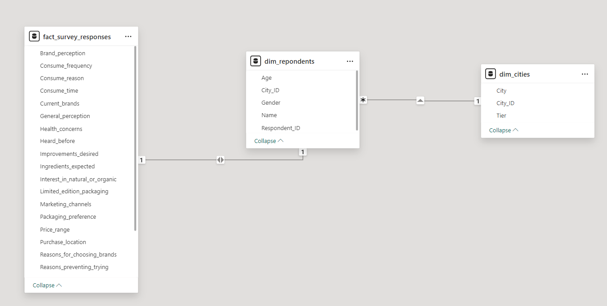
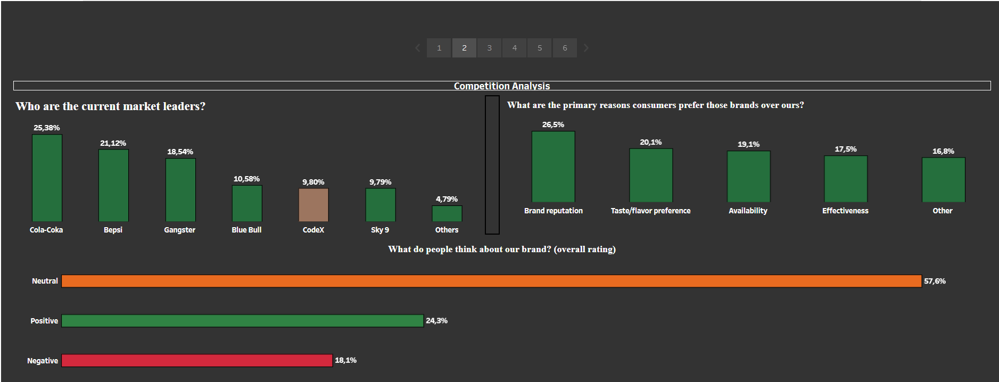
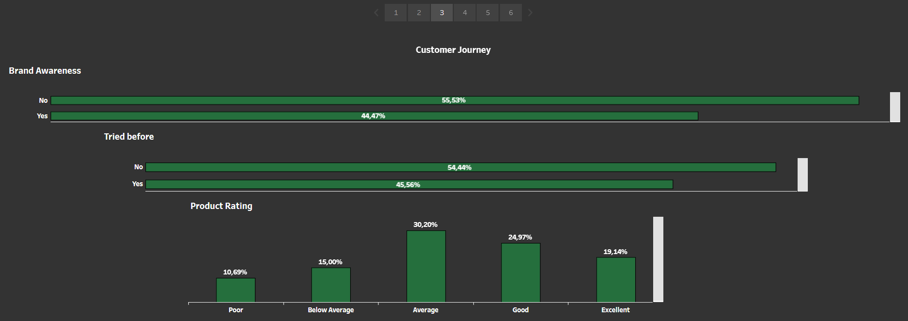
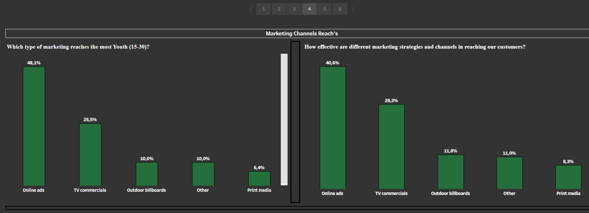
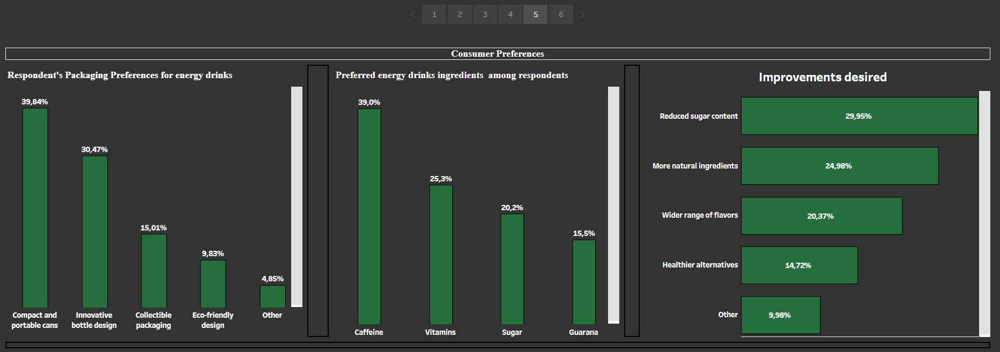
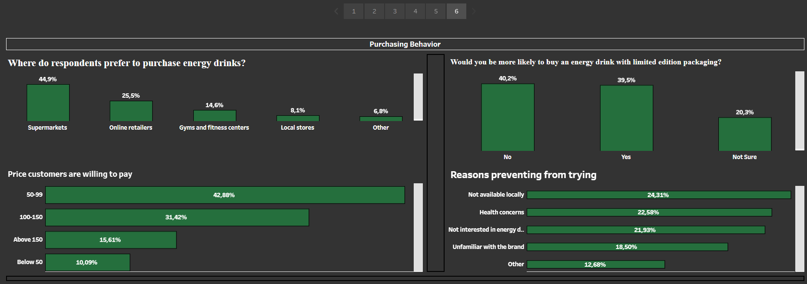

# Context
CodeX is a German beverage company that is aiming to make its mark in the Indian market. A few months ago, they launched their energy drink in 10 cities in India.

Their Marketing team is responsible for increasing brand awareness, market share, and product development. They conducted a survey in those 10 cities and received results from 10k respondents. 

## Data Structure & Transformation
The dataset consists of 3 CSV files dim_respondents; dim_cities; fact_survey_responses

o Some respondents’ answers were inconsistent. For instance, a person is less likely to have tasted the drink if they haven’t heard about it. I had to filter out all those incoherent answers when needed for the 
   visualization.
   
o I created new dimensions with Groups in Tableau at the visualization level. The Five consumption frequency types have been grouped into Three. 

### Key Insights

#### Demographics & Target Audience

Male Dominance: 60% of energy drink consumers are male, indicating a strong male demographic presence.

Youth Appeal: The dominant age group for energy drink consumption is between 19 and 30 years old (55%), suggesting that marketing efforts should focus on younger adults.

##### Geographical Hotspots: Bangalore, Mumbai, Pune, Chennai, and Delhi have the highest consumption frequency, with consumers in these cities drinking energy drinks 2-3 times a week or daily. These cities should be prioritized for targeted campaigns.

#### Brand Positioning & Competitive Landscape:

Brand Ranking: CodeX currently ranks 5th among energy drink brands, highlighting significant room for improvement in market positioning.

Brand Perception Challenge: 58% of respondents have a neutral opinion about CodeX, with brand reputation identified as a major blind spot. As a relatively new entrant in the market, this indifference can be attributed to low brand awareness and engagement.

Taste Matters: Although brand reputation is the primary driver for energy drink preference, taste/flavor is a close second. Enhancing taste perceptions could elevate brand standing.

#### Marketing Funnel Efficiency:

Awareness vs. Conversion: Of the 10,000 respondents, 44.5% (4,447) have heard of CodeX. However, only 46% of these (2,026) have actually tasted the product, highlighting a conversion gap.

Positive Experience Post-Tasting: Among those who tried CodeX, 75% (1,517) had a positive opinion, suggesting a strong product-market fit once consumers engage. 

##### Increasing efforts to move potential customers from awareness to consideration could significantly boost loyalty and market share.

#### Effective Marketing Channels:

Digital Dominance Among Youth: 40% of respondents encounter energy drink ads online, with online ads being 8% more effective in reaching the 15-30 age group. This underscores the importance of digital marketing, particularly targeting younger consumers.

##### To capitalize on this, CodeX should not only focus on online ads but also invest in engaging content, possibly through collaborations with influencers who resonate with this demographic.

#### Consumer Preferences & Product Development:

Packaging Preferences: 40% of respondents favor compact and portable cans, signaling a need for convenient packaging solutions.

Ingredient Priorities: Caffeine remains the preferred ingredient for 40% of respondents, while 30% express a desire for less sugar. 

##### These insights suggest that CodeX should focus on offering energy drinks that are both portable and aligned with health-conscious trends (more caffeine, vitamins, and less sugar).

#### Purchase Behavior & Distribution Strategy:

Retail Dominance: 45% of respondents purchase their energy drinks at supermarkets, yet 25% noted product unavailability as a barrier to trying CodeX. Expanding distribution to Convenience Stores, Gas Stations, and Vending Machines is crucial.

Price Sensitivity: With 43% of respondents willing to pay up to 99 rupees (approximately $1.19) for an energy drink, pricing strategies should reflect this threshold to maximize accessibility and competitiveness.

